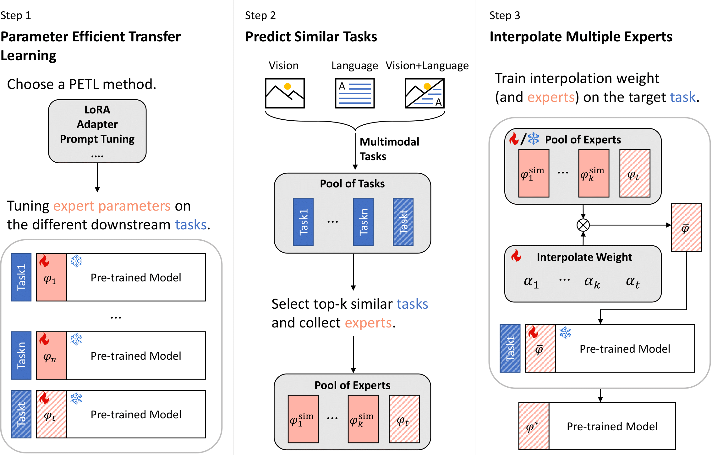
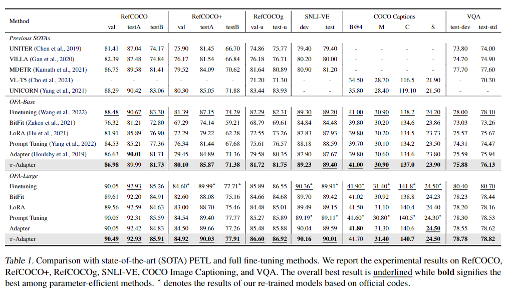
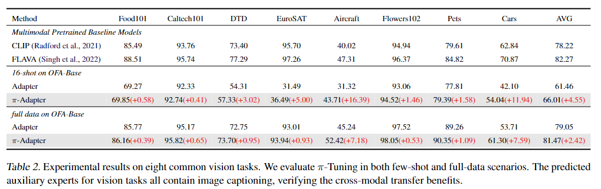
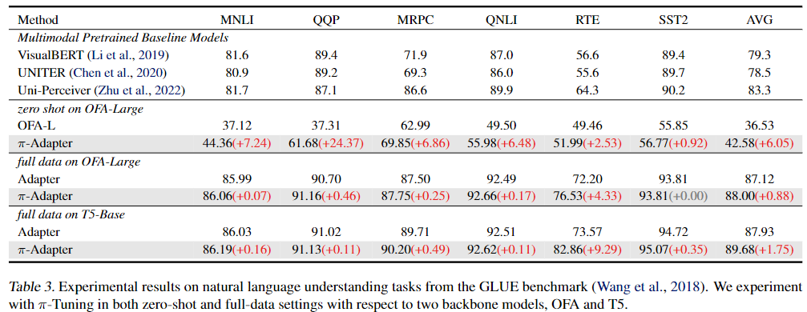

# $\pi$-Tuning: Transferring Multimodal Foundation Models with Optimal Multi-task Interpolation

> Chengyue Wu, Teng Wang, Yixiao Ge, Zeyu Lu, Ruisong Zhou, Ping Luo, Ying Shan

This repo is the official implementation of the paper <a href="https://arxiv.org/abs/2304.14381"> $\pi$-Tuning: Transferring Multimodal Foundation Models with Optimal Multi-task Interpolation </a>.



## News

<!-- + **[2023.02]** Our paper is accepted to CVPR 2023. -->
+ **[2023.04]** The official code is released.

## Main Results

### Vision-Language Benchmarks



### Vision Benchmarks



### Language Benchmarks



## Instruction

### Dataset and Checkpoints Preparation

See [datasets.md](datasets.md) for dataset preparation. As for the checkpoints, please see [checkpoints](checkpoints.md).

### Installation
```bash
pip install -r OFA/requirements.txt
```
### Training and Evaluation

We use NVIDIA A100 GPUs for training and evaluation. The detailed hyper-parameters can be found in the Appendix. 

#### Step 1: PETL training
We provide several demo scripts that have all the required parts for PETL training:
* OFA/run_scripts/refcoco/train_refcoco_adapter.sh 
* OFA/run_scripts/refcoco/train_refcoco_prefix.sh
* OFA/run_scripts/refcoco/train_refcoco_lora.sh 

Usage:
```bash
cd OFA
bash ./run_scripts/refcoco/train_refcoco_adapter.sh
```
A few options of note:
*   `--encoder-prompt` :: whether to insert prompts to the encoder
*   `--decoder-prompt` :: whether to insert prompts to the decoder
*   `--encoder-prompt-length` :: encoder prompt length
*   `--decoder-prompt-length` :: decoder prompt length
*   `--bitfit` :: whether to use bitfit
*   `--adapter` :: whether to use adapter
*   `--adapter-dim` :: adapter projection dim
*   `--lora` :: whether to use lora
*   `--lora-r` :: lora rank

#### Step 2: Task similarity measurement
We provide a demo script to calculate task embedding of RefCOCO based on Fisher Information Matrix (FIM) with diagonal approximation: `OFA/run_scripts/refcoco/refcoco_task_emb.sh `

Usage:
```bash
cd OFA
bash ./run_scripts/refcoco/refcoco_task_emb.sh
```

A few options of note:
* `--task-emb` :: task embedding calculation
* `--task-emb-file-path` :: directory to save task embedding result (we recommend to save it under OFA/results/task_name/)

After obtaining the embedding of each task, use the [task_emb_post_process.ipynb](./OFA/results/task_emb_post_process.ipynb) to calculate the similarity of tasks.

#### Step 3: Expert interpolation
We provide a demo script to interpolate 3 experts (RefCOCO, RefCOCO+, RefCOCOg) for the target task, RefCOCO: `OFA/run_scripts/refcoco/train_refcoco_adapter_interpolation.sh`

Usage:
```bash
cd OFA
bash ./run_scripts/refcoco/train_refcoco_adapter_interpolation.sh
```

#### Evaluation
After the above steps, you can use `OFA/run_scripts/refcoco/evaluate_refcoco.sh` to evaluate the final checkpoint. Remember to change the path of checkpoint in the script.

Usage:
```bash
cd OFA
bash ./run_scripts/refcoco/evaluate_refcoco.sh
```

We recommend that your workspace directory should be organized like this: 
```
OFA/
├── checkpoints/
│   ├── ofa_base.pt
│   ├── ofa_large.pt
│   └── ...
├── criterions/
├── data/
├── dataset/
│   ├── caption_data/
│   ├── refcoco_data/
│   └── ...
├── fairseq/
├── models/
├── run_scripts/
├── tasks/
├── train.py
├── trainer.py
└── utils/
```
### Acknowledgement

The code is based on the official implementation of [OFA: Unifying Architectures, Tasks, and Modalities Through a Simple Sequence-to-Sequence Learning Framework](https://github.com/OFA-Sys/OFA).

<!-- 
### Citation

If you find our work helps, please cite our paper.

```tex
@article{zeng2022learning,
  title={Learning Transferable Spatiotemporal Representations from Natural Script Knowledge},
  author={Zeng, Ziyun and Ge, Yuying and Liu, Xihui and Chen, Bin and Luo, Ping and Xia, Shu-Tao and Ge, Yixiao},
  journal={arXiv preprint arXiv:2209.15280},
  year={2022}
}
``` -->

### License

This research paper makes references to some open-source projects. Credits are given to these projects. See [License.txt](License.txt) for details.


